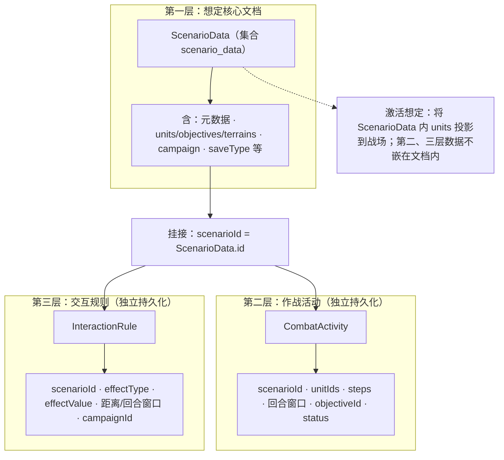

# CombatSystem 总体结构图

本目录提供 **SVG 矢量图**、**Mermaid 源码** 与 **ASCII**，可按需插入 Word / Typora / GitHub。

| 文件 / 位置 | 说明 |
|------|------|
| **`overall-structure.svg`** | 系统总体架构矢量图。 |
| **`diagram-scenario-three-layers.svg`** | 想定数据模型三层关系（高精度排版）。 |
| **下文「Mermaid：想定三层图」** | 同主题，便于在支持 Mermaid 的编辑器中直接渲染。 |
| **ASCII** | 无渲染环境备用。 |

---

## 矢量图：`overall-structure.svg`

- 路径：`docs/overall-structure.svg`  
- 使用：资源管理器中双击用 Edge / Chrome 打开；Word 中 **插入 → 图片 → 此设备** 选择该文件。  
- 图题建议：**图 X  CombatSystem 总体架构图**

---

## 文本结构图（ASCII）

适用于不能直接插图的环境，或作为论文附录。

```
                        ┌──────────────┐
                        │     用户      │
                        └──────┬───────┘
                               │
                        ┌──────▼───────┐
                        │   浏览器      │
                        │ index.html   │
                        │  HTTP/JSON   │
                        └──────┬───────┘
                               │
                 ┌─────────────▼─────────────┐
                 │   REST 接口层 Controller   │
                 └─────────────┬─────────────┘
           ┌──────────────────┼──────────────────┐
           │                  │                  │
    ┌──────▼──────┐    ┌──────▼──────┐   ┌──────▼──────┐
    │ 模块一       │    │ 模块二       │   │ 模块三     │
    │ 想定数据建模  │   │ 作战活动建模  │   │ 交互过程    │
    │             │    │             │   │ 建模       │
    │ Scenario    │    │ Combat      │   │ Interaction│
    │ Service     │    │ Activity    │   │ Rule       │
    │ Activation  │    │ Service     │   │ Service    │
    └──────┬──────┘    └──────┬──────┘   └──────┬──────┘
           │                  │                  │
           │    ┌─────────────▼─────────────┐    │
           │    │      推演与仿真            │    │
           │    │ CombatEngineService       │    │
           │    │ SimulationFacadeService   │    │
           │    └─────────────┬─────────────┘    │
           │           . . . .│. . . . . .(依赖)  │
           └──────────────────┼──────────────────┘
                              │
                    ┌─────────▼─────────┐
                    │   Repository 层    │
                    │  (Mongo 文档访问)  │
                    └─────────┬─────────┘
                              │
                    ┌─────────▼─────────┐
                    │     MongoDB       │
                    │   (数据库 bigdb)   │
                    └───────────────────┘
```

### 想定数据模型 · 三层关系（详细图）

**优先使用矢量图**：打开 **`diagram-scenario-three-layers.svg`**（与下述 Mermaid 含义一致；若 SVG 仍为「第二层 A/B」旧版，以本文 Mermaid 的三层编号为准）。

**为何之前像「只有两层」？**  
旧图画成「第一层 + 第二层 A/B」，容易误解成没有第三层。正确按**逻辑分层**应是：

1. **第一层**：想定核心文档 `ScenarioData`（一条 Mongo 文档 = 态势 + 战役母本）。  
2. **第二层**：作战活动 `CombatActivity`（独立集合，用 `scenarioId` 挂想定）。  
3. **第三层**：交互规则 `InteractionRule`（独立集合，同样用 `scenarioId` 挂想定）。  

中间的 **「scenarioId = 想定.id」** 是挂接关系，不是单独一层业务数据。

### Mermaid：想定三层图（第一层 / 第二层 / 第三层）

复制到 [Mermaid Live](https://mermaid.live) 或 VS Code（Mermaid 插件）中渲染，可导出 SVG/PNG。



以下为极简 ASCII，仅作备忘：

```
  [ 第一层：ScenarioData 文档 ]
              | scenarioId
      ┌───────┴───────┐
      ▼               ▼
 [ 第二层：CombatActivity ]   [ 第三层：InteractionRule ]
```

---

## 与代码包对应关系

- 接口层：`com.military.combat.controller`（含 `v2` 子包）  
- 应用层：`com.military.combat.service`、`simulation`  
- 领域模型：`com.military.combat.entity`  
- 持久化：`com.military.combat.repository`  

---

*若 Word 中 SVG 显示异常，可用浏览器打开 `overall-structure.svg`，截图或打印为 PDF 再插入。*
