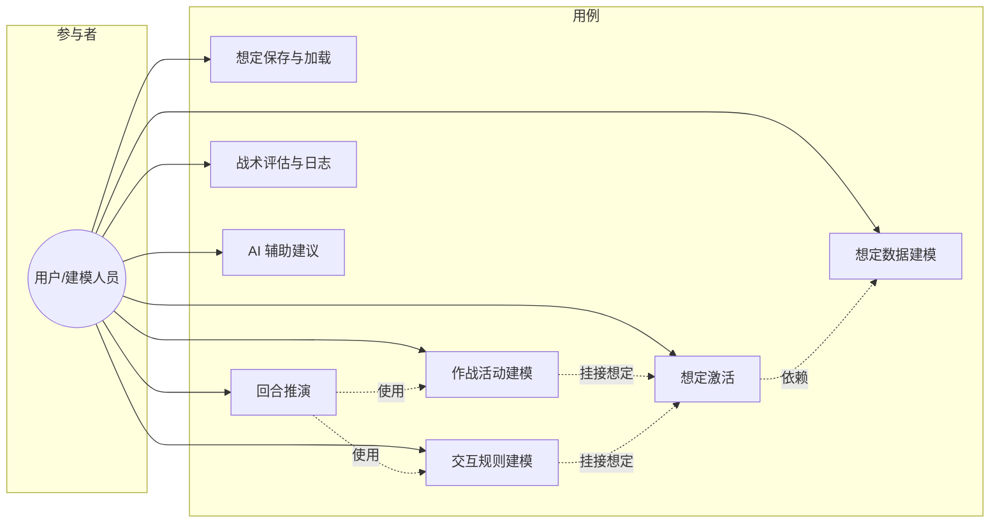
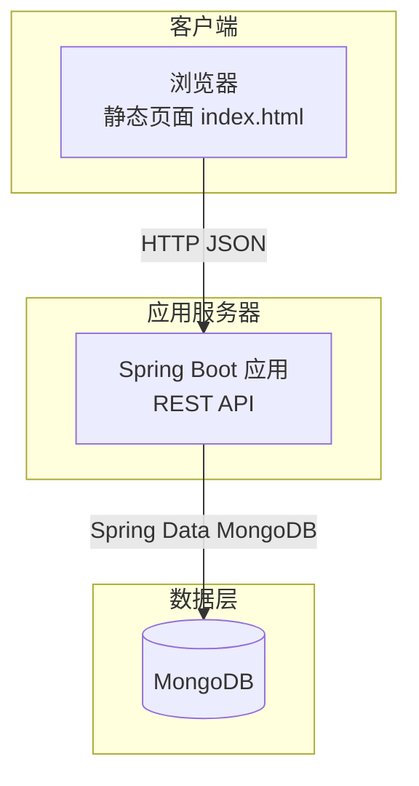
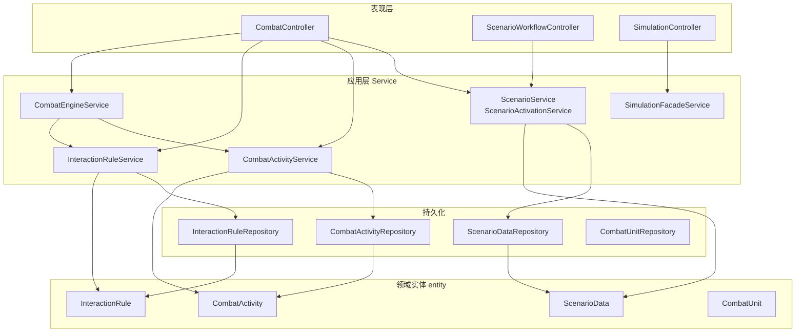
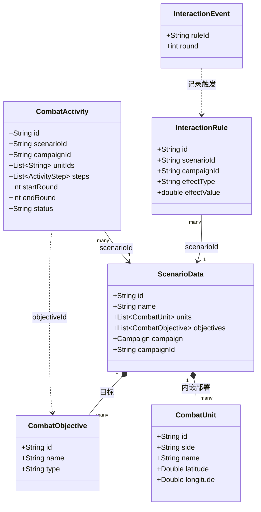
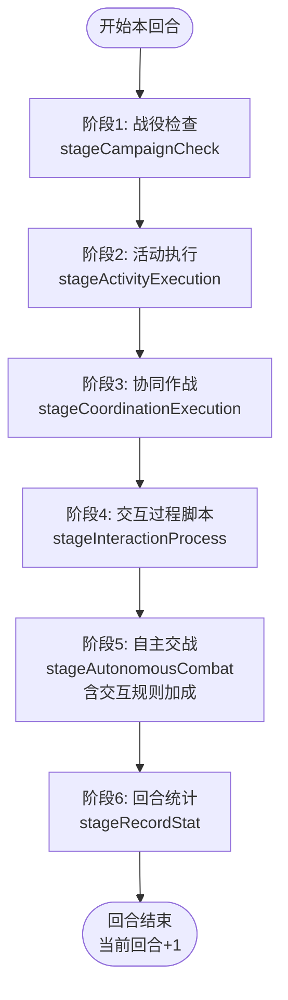
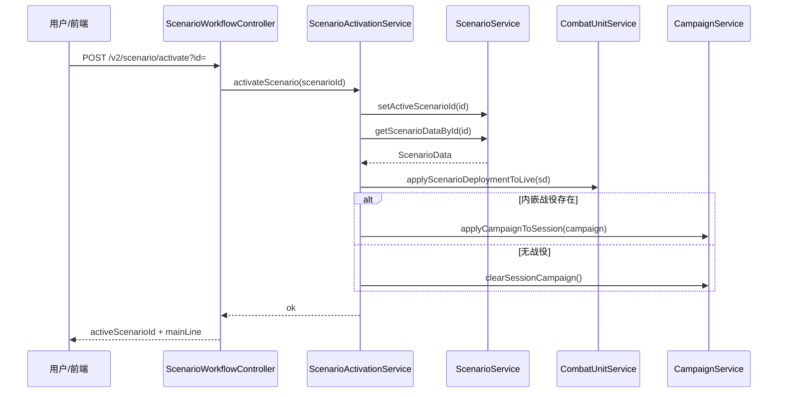
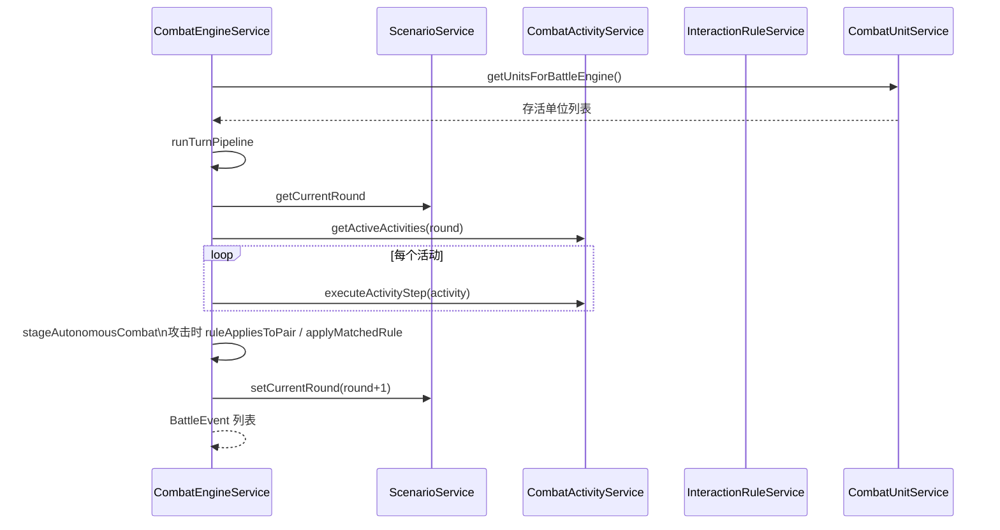
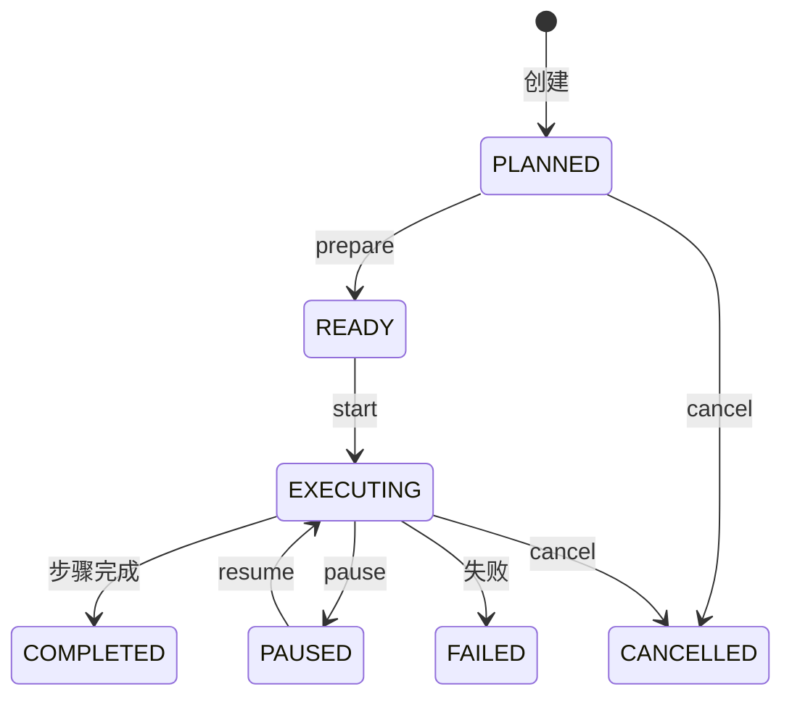

# CombatSystem 论文/答辩用 UML 图建议与源码

本文档说明**建议绘制哪些 UML 图**（与论文常见结构对应），并给出 **Mermaid** 源码。可直接在 VS Code / Typora / GitHub 预览，或用 [Mermaid Live Editor](https://mermaid.live) 导出 **PNG/SVG** 插入 Word/PPT。

---

## 建议生成的 UML 一览

| 图类型 | 用途 | 是否建议 |
|--------|------|----------|
| **用例图** | 说明系统与用户/外部角色的功能边界，对应任务书「三大模块」 | **强烈建议** |
| **系统上下文 / 部署图** | 浏览器、Spring Boot、MongoDB 关系，论文「部署环境」 | 建议 |
| **包图 / 分层结构图** | `controller` → `service` → `repository` → `entity`，体现分层架构 | 建议 |
| **核心领域类图（简图）** | `ScenarioData`、`CombatUnit`、`CombatActivity`、`InteractionRule` 及关联 | **强烈建议**（宜简不宜全） |
| **活动图** | 回合推演管线 `runTurnPipeline` 各阶段顺序 | **强烈建议**（主线清晰） |
| **序列图** | 「激活想定」「模拟一回合」两条关键路径 | **强烈建议** |
| **状态图** | `CombatActivity` 生命周期（计划中→执行中→完成等） | 可选 |
| **组件图** | 三大模块与引擎的依赖，可与包图二选一 | 可选 |

**不建议**：把全部 60+ 个类画在一张类图里——论文里通常用 **2～3 张简图** 分「领域模型」「推演引擎协作」即可。

---

## 1. 用例图（任务书对齐）



> 说明：严格 UML 用例图在 Mermaid 里表达有限，答辩可用 **PlantUML** 重画；上图为 **流程图风格** 的等价表达。若需经典椭圆用例图，可在 draw.io / StarUML 中照此列表绘制。

---

## 2. 部署图（逻辑部署）



---

## 3. 分层 / 包结构（示意）



---

## 4. 核心领域类图（简图）

仅保留与三大模块和推演**最相关**的类与关联；属性已大幅省略。



---

## 5. 活动图：回合推演管线 `runTurnPipeline`



---

## 6. 序列图：激活想定



---

## 7. 序列图：模拟一回合（概要）



---

## 8. 状态图：作战活动 `CombatActivity`（简化）



---

## 导出为图片的步骤

1. 打开 [https://mermaid.live](https://mermaid.live)  
2. 将某一节 **```mermaid … ```** 中的代码（不含外层 markdown 围栏）粘贴到左侧  
3. **Actions → Export PNG/SVG**  
4. 插入 Word：论文插图需编号与图题；PPT 可直接贴 PNG  

---

## 与论文章节的对应建议

| 论文章节 | 推荐使用 |
|----------|----------|
| 需求分析 | 用例图 §1 |
| 总体设计 | 分层图 §3、部署图 §2 |
| 详细设计-数据模型 | 类图 §4 |
| 详细设计-推演引擎 | 活动图 §5、序列图 §6～7 |
| 可选：活动状态 | 状态图 §8 |

---

*文档随项目演进可增删类名；若类图与代码不一致，以 `entity` 包为准。*
